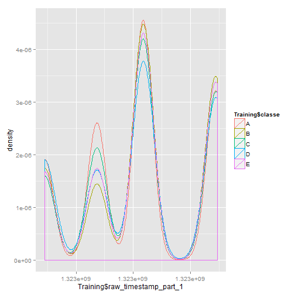
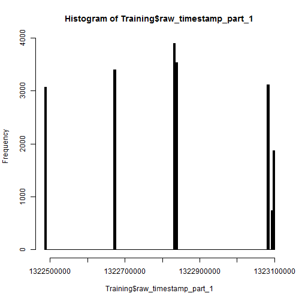

21.06.2014 Assignment Writeup done for the Coursera course "Practical Machine Learning" of "Data Science" Specialization track.
========================================================
The report consists of three part:

- Data Processing and Filtering
- Variable Selection
- Model Building

# Some R Code Is Not Visible In The HTML And PDF File => No Spoiler!
## Data Processing and Filtering
### Loading the needed libraries

```r
library(caret)
```

```
## Warning: package 'caret' was built under R version 3.0.3
```

```
## Loading required package: lattice
```

```
## Warning: package 'lattice' was built under R version 3.0.3
```

```
## Loading required package: ggplot2
```

```
## Warning: package 'ggplot2' was built under R version 3.0.3
```

```r
library(randomForest)
```

```
## Warning: package 'randomForest' was built under R version 3.0.3
```

```
## randomForest 4.6-7
## Type rfNews() to see new features/changes/bug fixes.
```

```r
library(ggplot2)
```

### Loading the data

```r
TrainingSet <- read.csv("pml-training.csv", header=T, sep=",")
TestingSet <- read.csv("pml-testing.csv", header=T, sep=",")
```

Check for missing data in both training and test set

```r
TestCount <- apply(is.na(TestingSet), 2, sum)
TestRatio <- 100*TestCount/nrow(TestingSet)
TestResults <- data.frame(cbind(TestCount, TestRatio))
TestNames <- rownames(TestResults[TestResults$TestRatio>90,])
head(TestNames)
```

```
## [1] "kurtosis_roll_belt"   "kurtosis_picth_belt"  "kurtosis_yaw_belt"   
## [4] "skewness_roll_belt"   "skewness_roll_belt.1" "skewness_yaw_belt"
```

Based on the Analysis, we use only predictors with more than 90% completeness.

# Some Hidden Code => No Spoiler!


Additionally, we remove variables with a value near zero.

```r
nzvTrain <- nearZeroVar(NewTrainSet, saveMetrics = FALSE)
nzvTest <- nearZeroVar(NewTestSet, saveMetrics = FALSE)
Training <- NewTrainSet[,-nzvTrain]
Testing <- NewTestSet[,-nzvTest]
```

## Variable Selection

### Exploratory Analysis


```r
qplot(Training$raw_timestamp_part_1, col=Training$classe, geom = "density")
```

 

```r
hist(Training$raw_timestamp_part_1, breaks=200, col="black")
```

 

# Some Hidden Code => No Spoiler!

```
## Warning: invalid factor level, NA generated
```
### Combine Data

```r
Data$raw_timestamp_part_1 <- Data$raw_timestamp_part_1/100000
RTSP1 <- cut(Data$raw_timestamp_part_1, c(min(Data$raw_timestamp_part_1), 13226, 13227,13229, max(Data$raw_timestamp_part_1)), order=T)
```
# Some Hidden Code => No Spoiler!

## Model Building

### Build Random Forest model

```r
Model <- randomForest(training[,PredictorNames],training[,"classe"], importance=T, ntree=2000)
```
### Show the Random Forest Model

```r
print(Model)
```

```
## 
## Call:
##  randomForest(x = training[, PredictorNames], y = training[, "classe"],      ntree = 2000, importance = T) 
##                Type of random forest: classification
##                      Number of trees: 2000
## No. of variables tried at each split: 7
## 
##         OOB estimate of  error rate: 0.18%
## Confusion matrix:
##      A    B    C    D    E class.error
## A 5577    0    0    0    0   0.0000000
## B    4 3789    1    0    0   0.0013179
## C    0    9 3406    6    0   0.0043847
## D    0    0   13 3201    1   0.0043546
## E    0    0    0    2 3600   0.0005552
```
### Estimated Error 
- The estimated error of the model is only 0.18% as shown by the print function. 
- I got all 20 examples right.

### Cross-Validation
- I cite **Leo Breiman** and **Adele Cutler** from Berkeley: There is no need to carry out cross-validation as they [say here](http://www.stat.berkeley.edu/~breiman/RandomForests/cc_home.htm#ooberr):

> In random forests, there is no need for cross-validation or a separate test set to get an unbiased estimate of the test set error. It is estimated internally, during the run, as follows:

> Each tree is constructed using a different bootstrap sample from the original data. About one-third of the cases are left out of the bootstrap sample and not used in the construction of the kth tree.

> Put each case left out in the construction of the kth tree down the kth tree to get a classification. In this way, a test set classification is obtained for each case in about one-third of the trees. At the end of the run, take j to be the class that got most of the votes every time case n was oob. The proportion of times that j is not equal to the true class of n averaged over all cases is the oob error estimate. This has proven to be unbiased in many tests.
